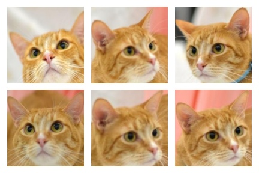
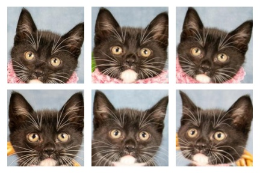

# NekoNet

This PyTorch repo contains:
- Mostly code and tools [we](https://github.com/L-E-G-s) built to train triplet loss ConvNets that learn vector descriptors for images of cat faces. 
- The cat face dataset we mined and used for training.
- Some models we trained using the framework.

Our team's original intent was focused on the cat stuff only, but we believe these tools can be used for training embedding extractor of other objects (e.g., human faces) as long as you have the data.

## Table of contents
- [Methodology overview](#methodology-overview)
  * [The cat face dataset](#the-cat-face-dataset)
  * [Model structure and techniques](#model-structure-and-techniques)
  * [What can be further improved](#what-can-be-further-improved)
- [Usage](#usage)
  * [Installation](#installation)
  * [Inference](#inference)
- [Pretrained models](#pretrained-models)
- [Train your own model](#train-your-own-model)
  * [Training data](#training-data)
  * [Training configuration](#training-configuration)

## Methodology overview
### The cat face dataset
We ran queries on [petfinder API](https://www.petfinder.com/developers/v2/docs/) to collect images of cats, grouped by their unique IDs. A cat face detector was trained using [YOLOv5](https://github.com/ultralytics/yolov5) to crop out the faces. We fixed/removed bad classes which either contain images of different cats or non-face images. All images were then resized to 224x224. The dataset after these preprocessing steps now has 7,229 classes of 34,906 images.

The figure below shows examples from 2 classes.

Class 818   | Class 5481
------------|------------
|

There was a problem with the dataset that we could not fix. Although we collected images based on the unique IDs of the cats, there were duplicate classes (different cat IDs but contain the same/similar set of images of a single actual cat).

### Model structure and techniques
For each face image input, we wanted to output a feature vector that abstractly captures its features. To achieve that, we used [triplet loss](https://arxiv.org/abs/1503.03832) as the models' criterion. The distance metric used was Euclidean distance. We tried all the techniques (batch-all, batch-hard and batch-semihard) in [the online triplet mining strategy](https://omoindrot.github.io/triplet-loss). With small batch size, this would partially remedy the problem of duplicate classes because these classes would ruin the training process only if they were sampled in the same batch.

We also added a loss term called [global orthogonal regularization](https://arxiv.org/abs/1708.06320) that statistically encourages seperate classes to be uniformly distributed on the unit sphere of embedding space.

The structure of a simple model would consist of a CNN backbone followed by a fully-connected layer. The output would then be L2-normalized to extract the final embedding. The figure below summarizes the model architecture.


So far, we have experimented with two CNN backbones: MobileNetV3-Large and EfficientNetV2-B0. For embedding dimensions, we have tried 64-D and 128-D.

### What can be further improved
From what we observed, here are some factors that can be improved for better results:
- **Data**: We would want more images per cat, no duplicate classes and more distinct classes.
- **Preprocessing**: Training and inference with face alignment would certainly produce better results.
- **Model**: We tried moderately small CNN backbones and embedding dimensions. Using larger backbones or/and higher embedding dimensions may produce better results, but would be marginal or have no effect unless we have a better dataset.
- **Hyperparameters**: We have yet to conclude the best hyperparameters (triplet loss margin, weight of GOR loss) when fitting on the dataset.
- **Training procedure**: It is recommended to use a very large batch size when training a triplet loss network, but for performance reasons we used at most 64.

## Usage
### Installation
Clone this repo and install the dependencies:
```bash
$ git clone https://github.com/20toduc01/NekoNet
$ cd NekoNet
$ pip install -r requirements.txt
```

### Inference
Creat a model with pre-trained weights:
```py
import torch
from models.descriptors import EfficientNetV2B0_128

device = 'cuda' if torch.cuda.is_available() else 'cpu'
model = EfficientNetV2B0_128(pretrained=True).to(device).eval()
```
Required transformation for a batch of images:
```py
import torchvision.transforms as T
transform = T.Compose([T.Resize((224, 224)),
                       lambda x : x/255.0,
                       T.Normalize(mean = [0.485, 0.456, 0.406], std = [0.229, 0.224, 0.225])])
```
Get the vector embedding of a single **face image**:
```py
from torchvision.io import read_image
path_to_image = './data/sample/test/2_2.jpg'
image = read_image(path_to_image).to(device) # 3xHxW uint8 torch tensor
embedding = model(torch.unsqueeze(transform(image), 0))
```
See `Example.ipynb` for usage with our pretrained face detector.
## Pretrained models
|       Model name      | Params (M) | Verification acc (%) | Download |
|:---------------------:|:----------:|:--------------------:|:--------:|
| EfficientNetV2-B0 128 |      6.02     |         96.2         |         [TorchScript](https://github.com/20toduc01/NekoNet/releases/download/v1.1/effnetv2_b0_128.torchscript.pt) · [ONNX](https://github.com/20toduc01/NekoNet/releases/download/v1.1/effnetv2_b0_128.onnx)            |


You can also load pretrained model in normal torch form, e.g.:
```py
from models.descriptors import EfficientNetV2B0_128
model = EfficientNetV2B0_128(pretrained=True)
```

## Train your own model
### Training data
The data should be organized such that images of each class are contained in a single folder, e.g.:
```
└───train
    ├───chonk
    │       1.jpg
    │       2.jpg
    │       3.jpg
    │       ...
    │
    ├───marmalade
    │       1.jpg
    │       2.jpg
    │       3.jpg
    │       ...
    │
    ├───...
    │
    └───unnamed
            1.jpg
            2.jpg
            4.jpg
            5.jpg
```

See [our sample dataset](./data/sample/train) for reference.

### Training configuration
Create a `.yaml` file that specifies training configuration like `sampleconfig.yaml`:
```yaml
---
  # General configuration
  epochs: 20
  batch_size: 16
  train_data: ./data/sample/train
  val_data: null
  out_dir: exp/sample
  
  # Triplet loss + GOR configuration
  loss_type: semihard
  loss_margin: 1.0
  alpha_gor: 1.0
  
  # Model configuration
  weight: null
  model: MobileNetV3L_64
  freeze: all
  unfreeze: [fc, l2_norm]
```
Training configurations of some of our runs can be found in `./config/`. You can define your own model in `./models/descriptors.py`.

### Start training
Simply run:
```bash
$ python train.py --config path_to_config.yaml
```

## References
- Our work was much inspired by [Adam Klein's report](http://cs230.stanford.edu/projects_fall_2019/reports/26251543.pdf).
- [Learning Spread-out Local Feature Descriptors](https://arxiv.org/abs/1708.06320), Zhang et al. (2017).